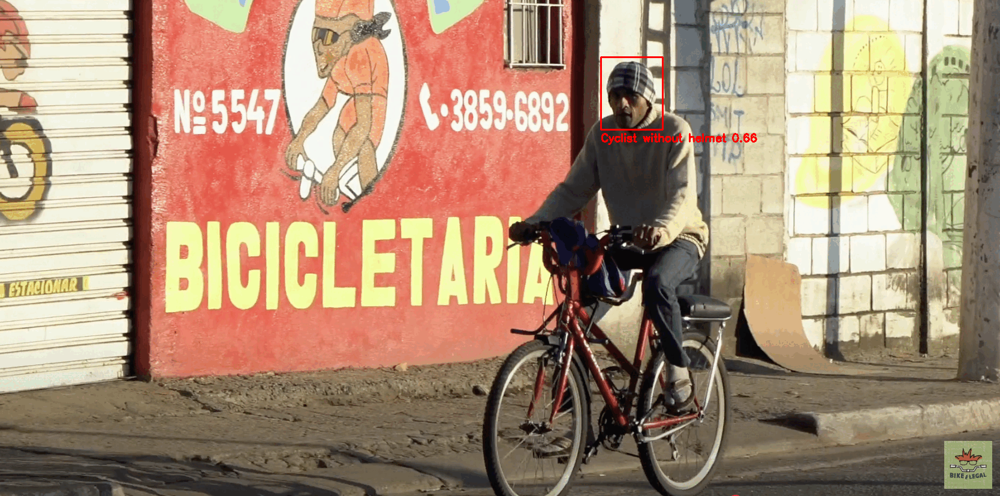

# Helmet Detection 🪖 🚴  🏍️ 
The use of helmets by cyclists and motorcyclists is essential for road safety, especially in accident situations. Studies show that helmets can significantly reduce the risk of head trauma and serious head injuries, which are common in collisions and falls. By protecting one of the most vulnerable areas of the body, the helmet acts as a crucial barrier between the impact and the brain, potentially making the difference between minor injuries and fatal consequences. Therefore, its use should not be seen merely as a recommendation, but as an indispensable safety measure. 

With this in mind, I developed this project with the goal of detecting helmet use among cyclists and motorcyclists. The project involves training a Deep Learning model using YOLO, capable of identifying through video whether a motorcyclist or cyclist is wearing a helmet or not.

# Base YOLO Model
The idea of this project is to detect cyclists or motorcyclists who are wearing or not wearing helmets. However, due to the absence of a specific dataset for this task, the detection process was divided into two parts.

Initially, YOLOv8n is used to detect people (to differentiate a bicycle from a cyclist, for example), bicycles, and motorcycles. Then, using the detection of helmet presence in the next step, the desired detection is achieved by intersecting the results from both detections.

# Fine-Tuning YOLO 
Training YOLOv8n is quite straightforward, as the API is transparent. However, it still requires a dataset specifically focused on helmet detection.
<p align="center">
  
</p>


In this project, I used the [Helmet Detection dataset](https://www.kaggle.com/datasets/andrewmvd/helmet-detection) available on Kaggle. Although it doesn't fully match my objective — as it includes various types of helmets, including those worn by motorcyclists

- License: CC0 (Public Domain)
- Classes: 2 categories — with helmet and without helmet
- Dataset Size: 764 images with corresponding annotations
- Image Format: PNG, with varying resolutions
- Annotations: Provided in XML format following the PASCAL VOC standard

All the steps performed during training are available in the ``train.py`` file.
 
#  🚀 Get started
Clone the repository
```
git clone https://github.com/colaresm/helmet-detection.git
cd helmet-detection
```

## ⚙️ Path configuration
- Locate the `utils` folder at the root of the project.  
- Find the `paths.py` file and, in the `dataset_path` variable, replace `helmet_detection_yolo` with the name of the folder containing your project.


📦 Installing Dependencies
```
pip install -r requirements.txt
```
## Training
- Taking the training is an optional step, you can skip to the testing step if you wish. 😁
- This project already includes a `yolov8n.pt` file inside the `models` folder, which contains the base YOLO model used for training.  
- Before starting the training, you must save the `annotations` and `images` inside the `data` folder.  
- To run the training, simply use the following command:

```
python train.py
```
- The training is performed with the following parameters: 320 epochs, 20 epochs of patience for early stopping, the entire dataset used as a single batch (`batch=-1`), checkpoints saved every 10 epochs, and a dropout rate of 0.2.  
- These parameters can be modified in the `train.py` file.


## Test
 If you have any questions about how to use the trained model, simply run the following command:


```
python test.py --help
```
Then something like this will be displayed in your terminal:

```
usage: test.py [-h] {image,video} file_path

Detect helmets in an image or video.

positional arguments:
  {image,video}  Input type: "image" or "video"
  file_path      File path, ex: data/test_data/test_image.png

options:
  -h, --help     show this help message and exit
```

### 🪖 Detectect helmets 
To detect helmets in an image the following command must be used:
```
python test.py  image path_your_image
```

To detect helmets in videos the following command must be used:
```
python test.py  video path_your_video
```

<p align="center">
  

## Contributing

1. Fork the repository.
2. Create a branch for your changes (`git checkout -b feature/new-feature`).
3. Commit your changes (`git commit -am 'Add new feature'`).
4. Push to the branch (`git push origin feature/new-feature`).
5. Open a pull request.

## Contact

- **Email**: colaresmarcelo2018@gmail.com
- **LinkedIn**: [engmarcelocolares](https://www.linkedin.com/in/yourlinkedin](https://www.linkedin.com/in/engmarcelocolares/))

